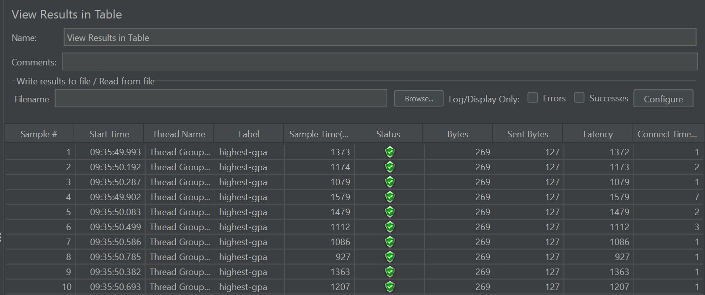
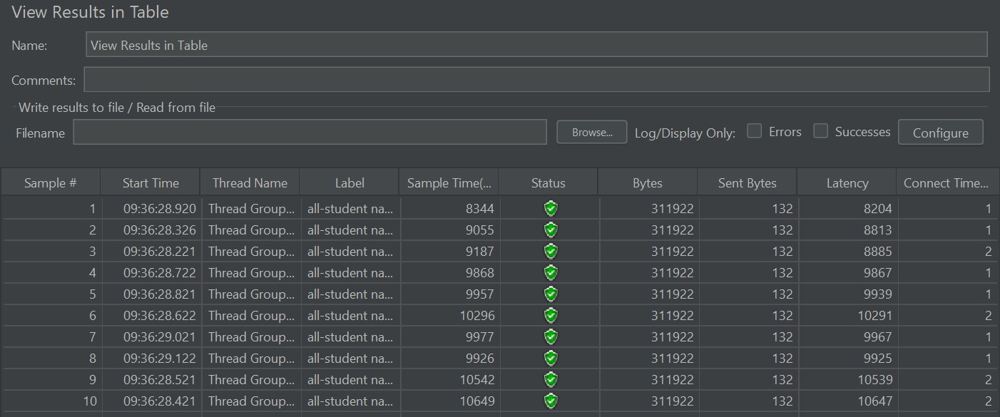
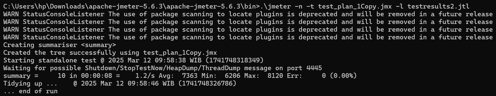
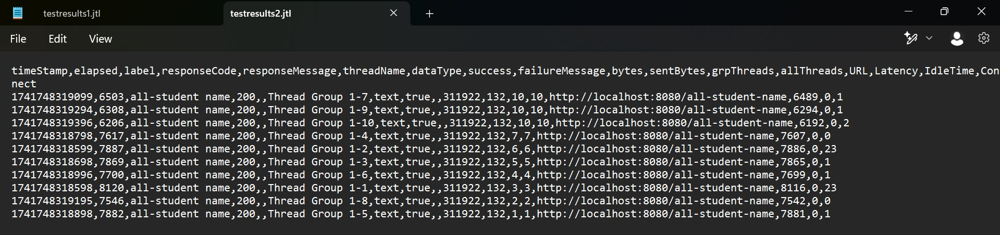
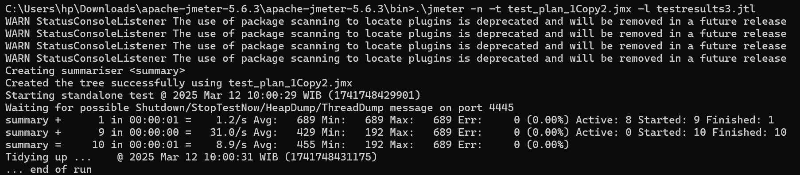
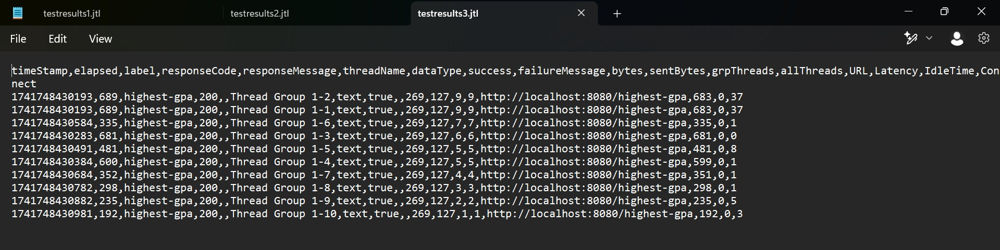
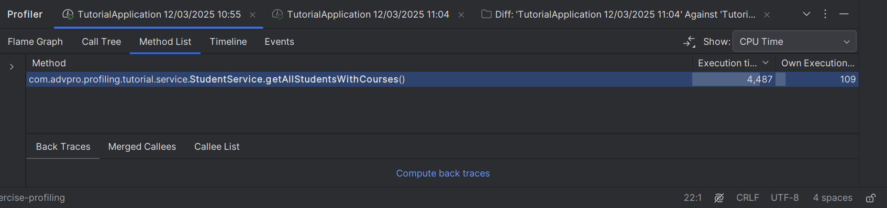
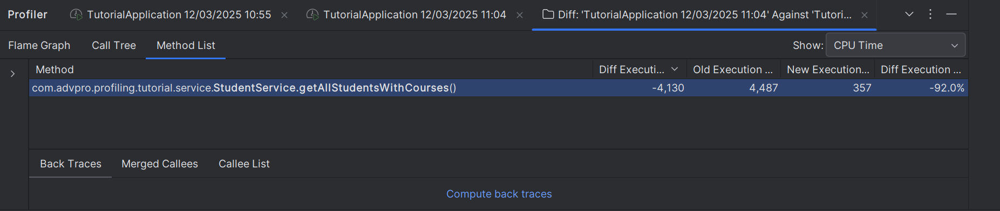

# Before Optimization
### Endpoint /highest-gpa

### Endpoint /all-student-name

# After Optimization
### Endpoint /highest-gpa

### Endpoint /all-student-name

# JMeter using command line
### Endpoint /all-student-name

### Endpoint /highest-gpa

## Optimizing method getAllStudentWithCourse
### Before

### After

### Comparison

