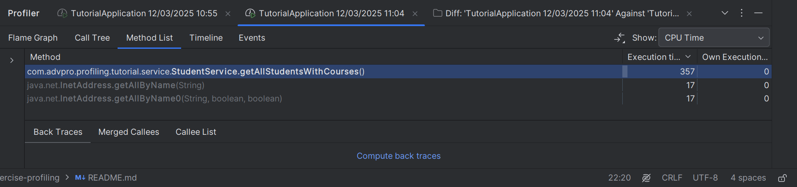
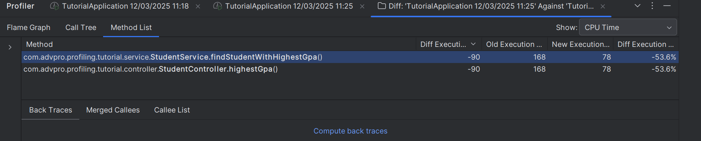

# Before Optimization
### Endpoint /highest-gpa

### Endpoint /all-student-name

# After Optimization
### Endpoint /highest-gpa

### Endpoint /all-student-name

### Conclusion
After the optimization, JMeter showed a huge improvement.
The pre optimization previously required thousands of milliseconds to execute, but post optimization, they experienced a reduction in execution time, even dropping to the single-digit millisecond range.

# JMeter using command line
### Endpoint /all-student-name

### Endpoint /highest-gpa

## Optimizing method getAllStudentWithCourse
### Before

### After

### Comparison

## Optimizing method highestGpa()
### Before

### After

### Comparison

# Reflection
Please answer the following questions:
1) What is the difference between the approach of performance testing with JMeter and profiling with IntelliJ Profiler in the context of optimizing application performance?\
    JMeter measures performance from an external view how many users an application can handle and how quickly it responds under various loads.
    IntelliJ Profiler provides an internal view, pinpointing which parts of the code consume the most CPU or memory and revealing the causes behind any slow performance.

2) How does the profiling process help you in identifying and understanding the weak points in your application?\
   By running a profiler, you not only see which methods or functions consume the most time but also monitor memory usage for leaks and inspect thread states to uncover issues.

3) Do you think IntelliJ Profiler is effective in assisting you to analyze and identify bottlenecks in your application code?\
   It shows clear graphs of CPU and memory use, so you can easily spot slow parts, making it great for finding the main causes of performance problem

4) What are the main challenges you face when conducting performance testing and profiling, and how do you overcome these challenges?\
    Some of the biggest challenge with performance testing and profiling involve making sense of the data these tools produce, dealing with differences between the testing environment and production, and keeping results consistent across platforms. 
    To address these issues, it helps to get trained in reading and using profiling tools, build a test setup that’s as close to the real environment as possible, and rely on more than one tool to double-check results.

5) What are the main benefits you gain from using IntelliJ Profiler for profiling your application code?\
    IntelliJ Profiler integrates directly into the IDE, allowing to start and stop profiling right where you code. 
    It offers real time CPU and memory stats, and a friendly interface making it easy to spot slowdowns.

6) How do you handle situations where the results from profiling with IntelliJ Profiler are not entirely consistent with findings from performance testing using JMeter?\
    I first check that both are using the same environment, data, and thread settings. 
    Then I look out for any extra overhead from the profiler, like running JMeter in non-GUI mode or using different machines if needed.
    Finally, I compare the logs and metrics side by side to see where things differ and make changes until they line up.

7) What strategies do you implement in optimizing application code after analyzing results from performance testing and profiling? How do you ensure the changes you make do not affect the application's functionality?\
    I first refactor any inefficient code so it runs as fast as possible. 
    I focus on the biggest slow areas, adjusting algorithms or data structures where needed. 
    To keep the functionality the same, I run thorough tests before and after each optimization and only change one thing at a time. 

